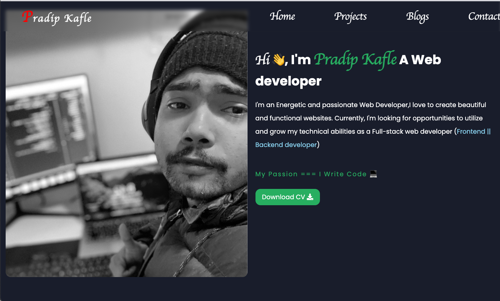

# Hi, I'm Pradip! 👋

## 🚀 About Me

I'm a full stack Javascript Developer...

## 🔗 Links

## About The Project

✅ This is the [personal portfolio project](https://paytm.com/)

Key Features:

- Build using HTML, plain css and Javascript
- Desktop aswell as mobile responsive design

## 👨🏻‍💻 Technologies used: HTML, Css, Javascript

## Screenshots

---

